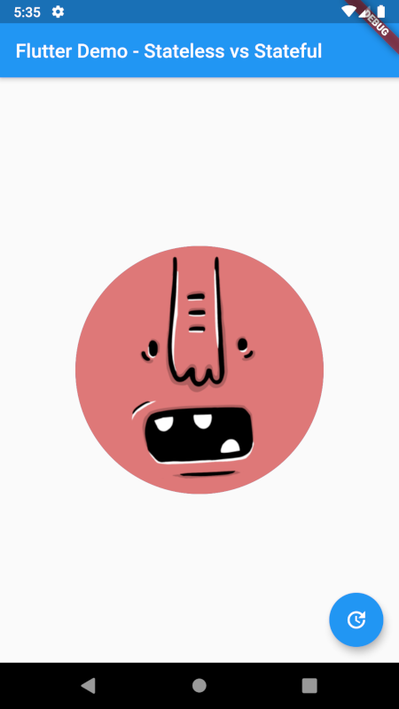

# Adorable app

A Flutter application showing adorable avatars using "Adorable Avatars" 

[API]: http://avatars.adorable.io/	"Adorable Avatars API."

## Getting Started

This project show StatefulWidget setState() function usage.

A few resources to get you started if this is your first Flutter project:

- [Lab: Write your first Flutter app](https://flutter.dev/docs/get-started/codelab)
- [Cookbook: Useful Flutter samples](https://flutter.dev/docs/cookbook)

For help getting started with Flutter, view our
[online documentation](https://flutter.dev/docs), which offers tutorials,
samples, guidance on mobile development, and a full API reference.
